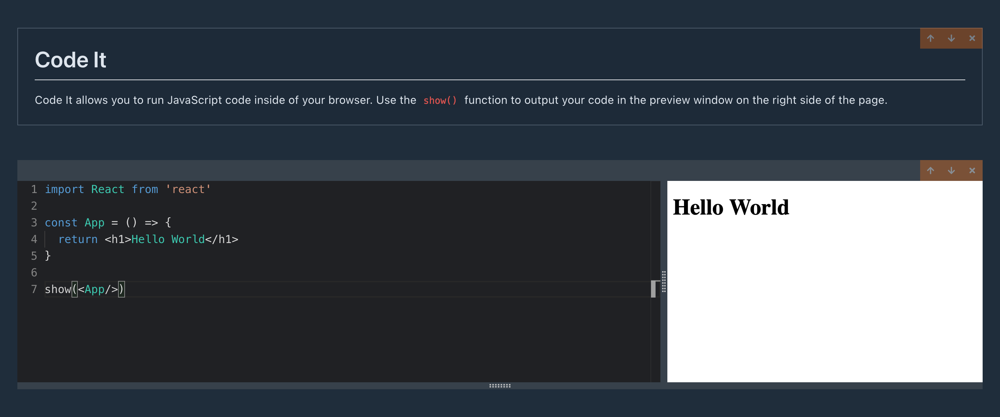

# Code It


Code It is a custom code and markdown editor that allows a user to run
JavaScript in the browser. Users can import npm packages to be used in their
code. Users can also create their own React components. Use the show function
`show()` to output your code into the preview component. Code cells are
cumulative and variables that are set in upper cells can be used in cells lower
on the page.

## Getting Started

To clone and run this application, you'll need [Git](https://git-scm.com) and
[Node.js](https://nodejs.org/en/download/) (which comes with [npm](http://npmjs.com))
installed on your computer. From your command line:

```bash
# Clone this repository
$ git clone https://github.com/ksentak/code-it.git

# Go into the repository
$ cd code-it

# Install dependencies
$ npm install

# Run the application in development mode
$ npm start
```

## Deployed Application


[https://code-it-01.netlify.app/](https://code-it-01.netlify.app/)

## Built With

- React
- TypeScript
- Redux
- Bulma (Styling)

## Author

Keaton Sentak - [Portfolio](https://keatonsentak.com) | [GitHub](https://github.com/ksentak)
